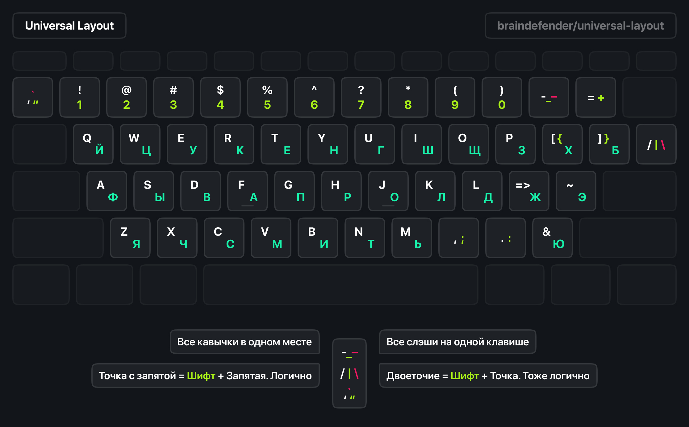
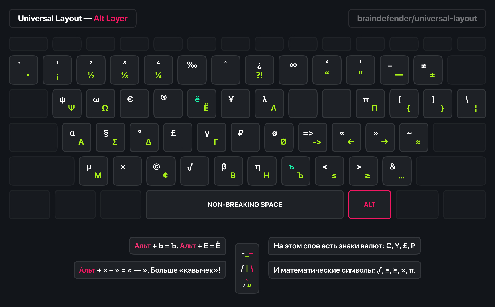

# Universal Layout




## How to install

### macOS

1. Copy the file Universal.bundle to ~/Library/Keyboard Layouts.
2. Restart your computer and log back into the system.
3. Go to System Settings > Keyboard > Input Sources and select the desired layout. It will appear under the Russian layout section.
4. (Optional) Remove standard layouts. To delete the default US layout, first add the Japanese layout, then delete the English layout, and finally remove the Japanese layout.

## Tips

### How to disable the system layout switcher popup

```bash
defaults write kCFPreferencesAnyApplication TSMLanguageIndicatorEnabled 0
```

That makes the system start using the old center screen HUD style input method switcher immediately, without needing to restart your system. 

Any open applications will still show a popup when the input method is changed. However, once an app is restarted, it will no longer show an indicator when it's changed.

### How to create .icns file

1. Create folder `icon.iconset`
2. Create images with the following sizes: 16x16, 32x32
3. Run the following command:

```bash
iconutil -c icns icon.iconset
```

## Thanks

This layout is based on the [Universal Keyboard Layout](https://github.com/braindefender/universal-layout) by braindefender.